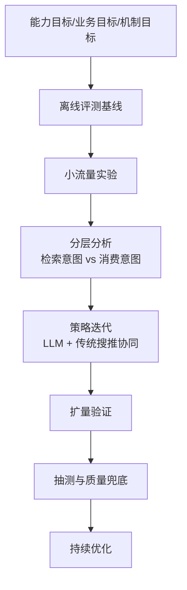

# Showcase 01｜AI Music（2024-2025）

> 角色定位：产品经理（PM）
> 
> 关键词：AI 原生应用、音乐消费、搜推融合、用户增长、实验驱动迭代

## 1. 项目背景
在「AI 个人助理」的大方向下，音乐被定义为高价值场景：
- 既能承接内容消费，也能提供陪伴价值；
- 既有明确检索需求，也有个性化推荐需求；
- 可作为 AI 原生应用能力建设的典型样板场景。

## 2. 目标定义
- **能力目标**：音乐场景体验达到行业头部水平，持续超越主要竞品。
- **业务目标**：成为主产品中的关键垂类，贡献长期留存和活跃收益。
- **机制目标**：建立可复用的 AI 原生应用迭代范式（评测 + 实验 + 抽测）。

## 3. 我负责的关键工作
1. **迭代机制设计**：推动“测试-评测-实验-抽测”闭环，保障开放域场景中的迭代质量。
2. **方案路径选择**：推动“大模型理解/生成能力 + 传统搜推相关性能力”的融合策略。
3. **用户洞察驱动**：基于 query 聚类、人群分层、行为路径分析制定差异化策略。
4. **阶段架构演进**：从早期 Multi-Agent 方案，演进到更统一的模型-工具协同范式。

## 4. 核心产品方法（可复用）

### 4.1 评测与实验双驱动
- 在开放域场景中，直觉不再稳定可靠，必须用“离线评测 + 在线实验”持续验证。
- 用统一标准、自动化评测、跨团队协作机制，提升迭代效率与稳定性。

### 4.2 LLM 与传统搜推协同
- 精确搜索、相似推荐、场景推荐、随便听听等意图采用差异化链路。
- 用 LLM 强化语义理解、信息补全与生成能力；
- 用传统搜推保障相关性、个性化与可控性。

### 4.3 用户理解体系
- 持续做人群画像、行为特征与 query 聚类分析；
- 按“检索类意图 vs 消费类意图”拆分评估，避免大盘指标掩盖真实效果；
- 针对新用户“随便点点看”的行为，优化入口与感知路径。

## 5. 阶段性结果（来自项目复盘）
- 形成了可持续迭代的音乐垂类方法与评测体系。
- 在长期指标、活跃与时长等方向拿到正向信号（多轮实验验证）。
- 音乐能力成为 AI 助手场景中的高价值组成部分，并验证了继续扩展的可行性。

> 注：本 Showcase 为公开版总结，已做脱敏与抽象，仅保留可公开的方法与结果方向。

## 6. 复盘与启发
- **先机制后功能**：在高不确定场景，先搭好评测与实验机制，再追求功能丰富。
- **先分人群再看大盘**：很多有效优化在总盘里会被稀释，分层分析更关键。
- **先协同再替代**：LLM 与传统系统不是非此即彼，更优解通常是协同。

## 7. 可迁移到其他 AI 产品的模板
- 目标框架：能力目标 × 业务目标 × 机制目标
- 迭代框架：评测基线 → 小流量实验 → 分层观察 → 扩量验证
- 决策框架：用户意图拆分 + 关键路径诊断 + 成本/质量平衡

## 8. 方法框架图（Mermaid）

